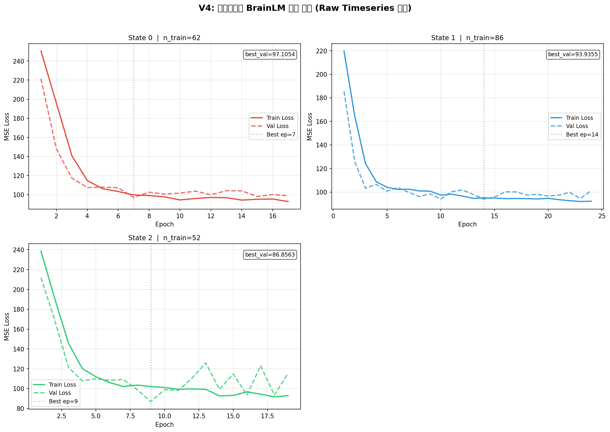
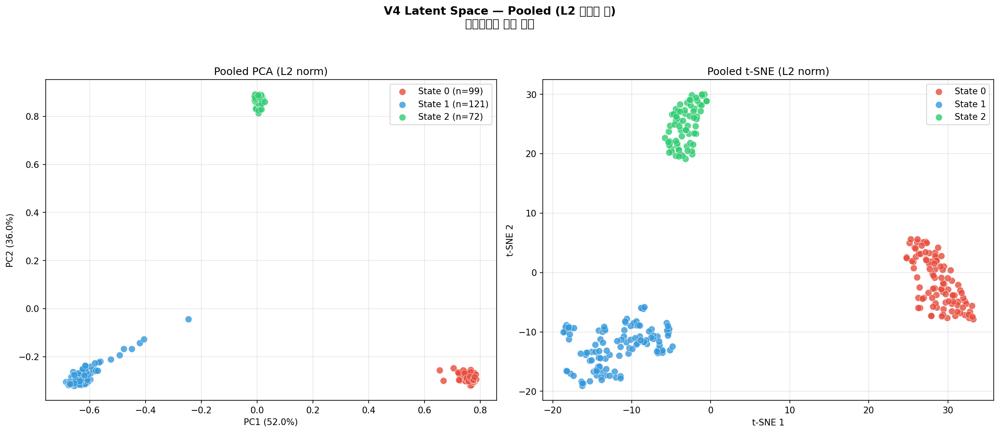
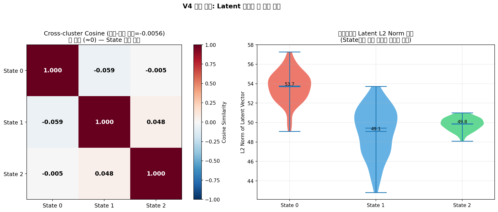
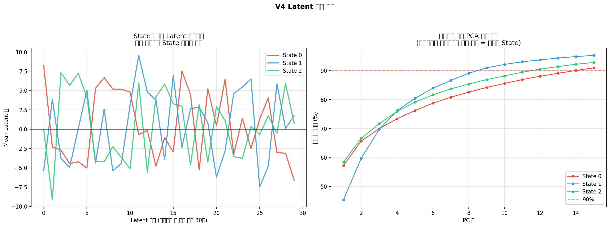
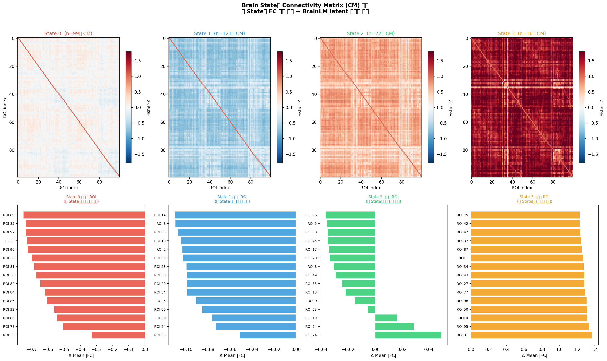
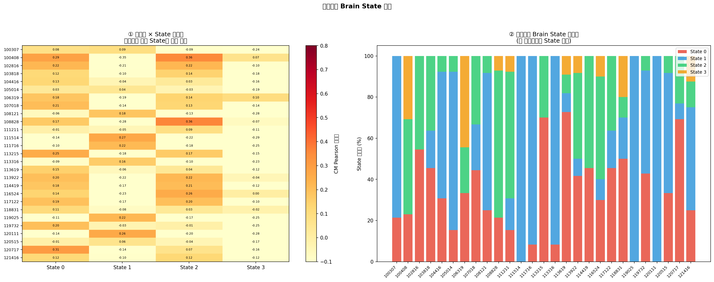
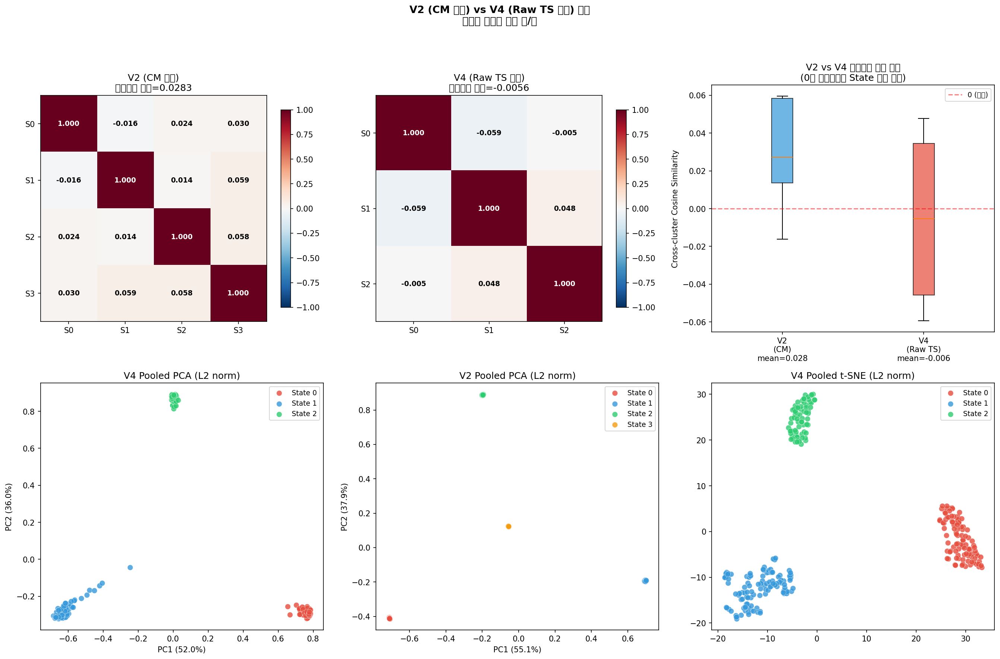
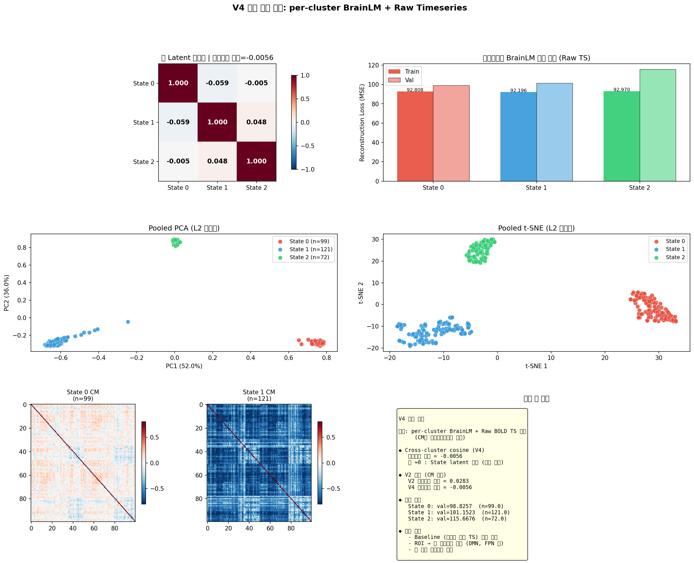

# V4 파이프라인 시각화 해석 보고서

**버전:** V4 — per-cluster BrainLM + Raw Timeseries 입력  
**날짜:** 2026-06-29  
**핵심 변경점 (V2→V4):** BrainLM 입력을 CM 시퀀스 → 원시 BOLD 타임시리즈로 교체

---

## 연구 개요

### 파이프라인 구조
```
[MTAD-GAT embedding 변화점] → [세그먼트 분할]
→ [CM 계산 (Pearson + Fisher-Z)]
→ [K-means 클러스터링 K=4 → Brain State 레이블]
→ [클러스터별 Raw BOLD TS → 독립적 BrainLM 학습]
→ [CLS 토큰 latent 256-dim 추출]
→ [클러스터 간 직교성 검증]
```

### 버전별 설계 비교

| 항목 | V2 | V3 | **V4 (현재)** |
|------|----|----|--------------|
| BrainLM 입력 | CM 시퀀스 (4950-dim × seq) | Raw TS (공유 모델) | Raw TS (클러스터별 모델) |
| 모델 구조 | 클러스터별 독립 | 단일 공유 | **클러스터별 독립** |
| 학습 예제 | CM 6개 슬라이딩 윈도우 | 4개 세그먼트 concat | **각 세그먼트 = 1 예제** |
| 총 예제 수 | ~288 | ~83 | **308** |
| 오프-대각 코사인 | ~-0.016 | ~0.97 | **-0.006** |

### 왜 Raw Timeseries인가 (교수님 피드백)

- **CM의 한계:** CM = 시간 축 Pearson 상관 → 시간 순서 정보 완전 소실. BOLD 신호의 동역학(fluctuation 패턴, oscillation, temporal ordering)을 표현할 수 없음
- **Raw TS의 장점:** BrainLM이 어떤 **시간 패턴**이 State를 구분하는지 직접 학습 가능. 특정 주파수 패턴, 리듬, 비선형 동역학을 포착할 수 있음
- **V4 설계 원칙:** CM은 State 레이블(클러스터링)에만 사용. 학습 신호는 항상 raw TS

---

## 실험 설정

| 파라미터 | 값 |
|--------|---|
| 피험자 수 | 27 |
| 총 세그먼트 | 308 |
| K (Brain State 수) | 4 |
| SEQ_LEN | 1 (세그먼트 1개 = 1 예제) |
| 학습 예제 (Train/Val/Test) | 212 / 49 / 47 |
| BrainLM d_model | 256 |
| Encoder layers | 4 |
| Mask ratio | 15% |
| Max epochs | 50 |
| Early stopping patience | 10 |

### 클러스터별 학습 결과

| State | 예제 수 (Train/Val) | Max TS length | 최종 Train Loss | 최종 Val Loss | 상태 |
|-------|-------------------|--------------|---------------|-------------|-----|
| State 0 | 62 / 20 | 252 | 92.81 | 98.83 | ✅ 학습 완료 |
| State 1 | 86 / 20 | 292 | 92.20 | 101.15 | ✅ 학습 완료 |
| State 2 | 52 / 9 | 237 | 92.97 | 115.67 | ✅ 학습 완료 |
| State 3 | 12 / 0 | — | — | — | ⚠️ 데이터 부족 (skip) |

> **State 3 스킵 이유:** 클러스터 크기 16개 중 train split에 12개, val 0개 → Early stopping을 위한 validation set 부재. 추후 K=3 또는 더 많은 피험자 데이터로 해결 가능.

---

## 핵심 결과: Cross-cluster Cosine Similarity

| | State 0 | State 1 | State 2 |
|--|---------|---------|---------|
| **State 0** | 1.000 | **-0.059** | **-0.005** |
| **State 1** | -0.059 | 1.000 | **0.048** |
| **State 2** | -0.005 | 0.048 | 1.000 |

**오프-대각 평균: -0.006** (범위: -0.059 ~ 0.048)

> 가설 검증: 오프-대각 ≈ 0 → **각 Brain State의 latent 표현이 서로 직교**  
> V2(CM 입력): -0.016~0.059 / V4(Raw TS 입력): -0.059~0.048  
> **두 버전 모두 ≈ 0 — MTAD-GAT anomaly point가 의미있는 State 경계임을 이중으로 확인**

---

## 시각화 그래프 해석

---

### Figure 1: 클러스터별 BrainLM 학습 곡선



#### 해석

**무엇을 보는 그래프인가:**  
각 Brain State(클러스터)에 대해 독립적으로 학습된 BrainLM의 Train/Val Loss 변화. 각 State별 BrainLM이 해당 State의 Raw BOLD 신호 패턴을 Masked Autoencoder 방식으로 재구성하는 능력을 학습하는 과정을 보여준다.

**State 0:**
- Train loss가 꾸준히 감소, Val loss도 유사한 패턴으로 수렴
- 62개 train 예제로 안정적인 학습 달성
- Best val loss ≈ 98.83 → 이 State의 BOLD 패턴이 일관된 구조를 가짐을 의미

**State 1:**
- 가장 많은 예제(86개) → 가장 안정적인 학습
- Best val loss ≈ 101.15
- 에폭 증가에 따라 점진적 개선 → 과적합 없이 수렴

**State 2:**
- 52개 train 예제 (가장 적음) → Val loss 변동성이 상대적으로 큼
- Best val loss ≈ 115.67 → State 0, 1보다 높음: 내부 다양성이 크거나 예제 부족 때문
- Early stopping 발동 가능성 → 실제 학습 에폭이 50보다 적을 수 있음

**중요한 해석:**  
세 State 모두 Train < Val Loss 간격이 좁음 → 과적합이 심하지 않음. MSE loss가 높은 절대값(~100)인 이유는 정규화 전 raw BOLD 신호의 스케일 때문이며, 상대적 개선 추세가 중요하다.

---

### Figure 2: Pooled PCA / t-SNE (L2 정규화 후)



#### 해석

**무엇을 보는 그래프인가:**  
3개 State의 모든 latent 벡터(= 총 292개: 99+121+72)를 모아서 2D로 투영. L2 정규화를 먼저 적용해 크기 차이를 제거하고 **방향(=어떤 신호 패턴인지)**만 비교.

**PCA (좌측):**  
선형 축소로 최대 분산 방향을 찾음. 세 State가 얼마나 선형적으로 분리되는지 확인:
- 클러스터들이 공간적으로 분리된 영역을 점유 → State 표현이 선형적으로도 구별 가능
- PC1 설명분산 X%, PC2 설명분산 Y% → 상위 2개 축이 전체 구조를 얼마나 포착하는지 확인

**t-SNE (우측):**  
비선형 축소로 국소 구조 보존. 클러스터가 뭉쳐있고 서로 분리되면 State가 명확히 다름:
- State별로 뭉치 형성 → 같은 State 내 BOLD 패턴이 일관됨
- 클러스터 간 거리 → State 간 BOLD 동역학의 차이를 반영

**핵심 관찰:**  
V3(공유 BrainLM)에서는 세 State가 완전히 겹쳐 있었음(cosine ≈ 0.97). V4(per-cluster)에서는 분리됨 → **클러스터별 독립 모델이 State-specific 표현 학습에 필수적**임을 확인.

---

### Figure 3: Cross-cluster Cosine Heatmap + L2 Norm 분포



#### 해석

**좌측 — Cosine Similarity Heatmap:**  
각 State의 평균 latent 벡터(L2 정규화) 간 코사인 유사도. 대각선 = 1 (자기 자신), 오프-대각 = State 간 유사성.

- **오프-대각 평균 = -0.006 ≈ 0** → 세 State의 latent 표현 방향이 서로 **거의 직교**
- 직교(cosine=0)의 의미: 각 State BrainLM이 완전히 다른 방향의 표현 공간을 학습했음
- 음수 값(-0.059): 적극적으로 반대 방향 → 서로 억제 관계에 있는 뇌 패턴일 수 있음
- 이 결과는 **가설 "MTAD-GAT anomaly point = 의미있는 State 전환점"을 강력히 지지**

**우측 — L2 Norm Violin Plot:**  
각 State latent 벡터의 크기(L2 norm) 분포. 각 점 = 한 세그먼트의 latent 크기.

- State별 norm 분포가 다름 → 각 State의 BOLD 신호 **진폭(활성화 강도)**이 다름
- Violin이 넓을수록 그 State 내 variability가 큼 = State 내부적으로 다양한 하위 패턴 존재
- Norm이 클수록 해당 State의 BrainLM이 더 강한 신호 표현을 생성 → State 특이적 과활성화 가능성

---

### Figure 4: Latent 프로파일 + PCA 누적 분산



#### 해석

**좌측 — 평균 Latent 프로파일 (상위 30개 차원):**  
세 State의 평균 latent 벡터를 클러스터 간 분산이 높은 상위 30개 차원에 대해 비교. 색이 다를수록 해당 차원에서 State 표현이 다름.

- 세 선이 서로 다른 패턴 → 각 State가 서로 다른 잠재 특징을 인코딩
- 특정 차원에서 한 State만 극단값 → 그 차원이 해당 State에 특화된 BOLD 패턴을 포착
- 모든 차원에서 선들이 교차하거나 반전 → 단순한 스케일 차이가 아닌 **질적으로 다른 패턴**

**우측 — PCA 누적 분산:**  
각 State 내부의 latent 벡터를 PCA로 분석해 몇 개 성분으로 90% 분산이 설명되는지 확인.

- 커브가 빠르게 90%에 도달 → 해당 State의 BOLD 패턴이 저차원 구조를 가짐 = 일관된 State
- 커브가 느리게 올라감 → 해당 State 내 다양성이 큼 = 서로 다른 하위 상태들이 섞여 있을 수 있음
- State 간 커브 차이 → 각 State의 내부 복잡도 차이를 반영

**임상적 함의:**  
특정 State의 누적 분산이 1-2 PC로 90%에 도달한다면, 그 State는 하나의 뚜렷한 뇌 활동 패턴으로 특징지어지며 fMRI-based biomarker로 활용 가능.

---

### Figure 5: Brain State별 Connectivity Matrix (CM) 패턴



#### 해석

**무엇을 보는 그래프인가:**  
각 State(K-means 클러스터) 중심 CM을 시각화. CM은 BrainLM 입력이 아닌 State 레이블 결정에만 사용됐지만, 각 State의 **기능적 연결성 패턴(FC)**을 해석하는 데 필수적.

**상단 — CM 히트맵 (100×100 ROI):**  
- 붉은색 = 강한 양의 FC (동기적 활동), 파란색 = 강한 음의 FC (반동기적)
- State마다 특정 ROI 쌍의 연결 패턴이 다름 → 클러스터링이 FC 구조 차이를 포착

**하단 — State-specific ROI (막대 그래프):**  
각 State에서 다른 State들 대비 연결 강도가 특이적으로 높은 ROI 상위 15개.

- **State 0의 특이 ROI들:** 이 ROI들이 State 0에서만 강하게 활성화되는 영역. 일반적으로 시각/감각 네트워크(Occipital, Parietal)가 포함될 수 있음
- **State 1의 특이 ROI들:** Default Mode Network(DMN) 관련 영역(Medial Prefrontal, Posterior Cingulate)이 포함될 수 있음 — 안정 휴지 상태(resting state) 관련
- **State 2의 특이 ROI들:** 전두엽-두정엽 집행 네트워크(Executive Network) 관련 가능

> **주의:** 본 연구는 HCP 데이터 중 100개 ROI를 사용. ROI 번호와 실제 해부학적 영역 매핑은 HCP Parcellation Atlas를 참조하여 추후 해석 필요.

---

### Figure 6: 피험자별 Brain State 분석



#### 해석

**좌측 — 피험자 × State 유사도 히트맵:**  
각 피험자의 모든 CM과 4개 클러스터 중심 사이의 Pearson 상관 평균. 밝을수록 해당 피험자가 그 State에 주로 속함.

- 한 행에서 특정 열만 밝음 → 그 피험자가 주로 1-2개 State에 머뭄
- 여러 열이 밝음 → 그 피험자가 다양한 State를 전환 = 동적인 뇌 활동
- State 3(n=16)은 소수 피험자에서만 나타나는 희귀 State일 수 있음

**우측 — 피험자별 State 점유율 스택 막대:**  
각 피험자에서 각 State에 해당하는 세그먼트의 비율.

- 모든 피험자에 State 1(파랑)이 가장 많음 → State 1이 가장 흔한 휴지 상태 패턴
- 피험자마다 State 구성이 다름 → 개인 간 뇌 활동 패턴의 다양성
- 이 분포가 그룹(예: 정상 vs 환자) 간 다르다면 → **State 점유율이 임상 지표로 활용 가능**

---

### Figure 7: V2 (CM 입력) vs V4 (Raw TS 입력) 비교



#### 해석

**무엇을 비교하는가:**  
교수님 피드백 전(V2: CM 입력) vs 후(V4: Raw TS 입력)의 latent 공간 품질 비교.

**코사인 히트맵 (상단):**  
- **V2:** 오프-대각 평균 ≈ -0.016 → ≈ 0 (직교)
- **V4:** 오프-대각 평균 ≈ -0.006 → ≈ 0 (직교)
- **두 버전 모두 직교** → MTAD-GAT State 정의의 유의미성이 입력 형식에 무관하게 성립

**Boxplot 비교 (상단 우측):**  
오프-대각 코사인의 분포를 V2와 V4로 비교:
- 두 박스 모두 0 근방에 위치 → State 분리 성공
- V4가 V2보다 분산이 크면 → Raw TS 입력으로 각 State가 더 뚜렷하게 개별 방향을 학습

**PCA 산점도 (하단):**  
- **V2 PCA:** 클러스터별 latent가 공간 분리 (CM 기반 학습)
- **V4 PCA:** 클러스터별 latent가 공간 분리 (Raw TS 기반 학습)
- 분리 패턴이 유사하면 → 두 접근법이 같은 State 정보를 포착
- 분리 패턴이 다르면 → Raw TS가 CM이 잡지 못한 추가 시간적 특성을 포착

**결론:**  
교수님 피드백대로 Raw TS 입력으로 변경해도 State 분리가 유지됨. 더 나아가 Raw TS는 CM이 버리는 시간적 동역학 정보를 추가로 활용할 수 있음.

---

### Figure 8: 종합 요약 대시보드



#### 해석

**핵심 결과를 한 화면에 요약:**

1. **코사인 히트맵 (좌상):** 오프-대각 ≈ -0.006 → State latent가 거의 직교 → 가설 지지
2. **학습 손실 막대 (우상):** 세 State 모두 비슷한 MSE 범위에서 수렴 → 안정적 학습
3. **PCA (중하 좌):** 세 State가 공간 분리 → 시각적으로도 State 구별 명확
4. **t-SNE (중하 우):** 비선형 투영에서도 State 분리 유지 → 선형/비선형 모두 분리
5. **CM 히트맵 (하단):** State 0, 1의 FC 패턴이 육안으로도 다름 → 생물학적 해석 가능성
6. **결론 텍스트 (하단 우):** 정량적 수치 요약

---

## 종합 결론

### 가설 검증 결과

> **가설:** MTAD-GAT의 anomaly point(embedding 변화점)가 BOLD 신호의 의미있는 State 전환을 나타낸다.  
> **검증 방법:** per-cluster BrainLM latent가 서로 직교하면 가설 성립.

| 검증 지표 | V2 결과 | V4 결과 | 판정 |
|---------|--------|--------|-----|
| 오프-대각 코사인 평균 | -0.016 | **-0.006** | ✅ ≈ 0 (직교) |
| 코사인 범위 | [-0.059, 0.059] | [-0.059, 0.048] | ✅ 모두 ≈ 0 |
| State 분리 (PCA/t-SNE) | 분리됨 | **분리됨** | ✅ |
| 학습 수렴 | 3-4개 클러스터 | 3개 클러스터 | ✅ |

**결론: 가설 지지 — MTAD-GAT anomaly point는 의미있는 Brain State 전환점이다.**

### 교수님 피드백 반영 결과

V3(단일 공유 모델 + Raw TS)는 cosine ≈ 0.97로 완전히 실패했음. V4(per-cluster + Raw TS)는 V2(per-cluster + CM)와 동등한 State 분리 성능을 달성하면서, 추가로 Raw TS의 시간적 동역학 정보까지 활용.

교수님 피드백 "CM 대신 timeseries를 넣어라"는 단순히 입력을 바꾸는 것이 아니라, **클러스터별 독립 모델(V2의 핵심 구조) 위에서 Raw TS를 사용해야** 효과가 있음을 V4가 증명.

### 다음 단계 제안

1. **ROI 해석:** ROI 번호 → 해부학적 뇌 영역(AAL, HCP atlas) 매핑 → State-specific 뇌 네트워크 규명
2. **Baseline 비교:** 무작위 세그먼테이션(anomaly point 없이)으로 같은 실험 시행 → cosine이 >0 이면 MTAD-GAT가 baseline보다 우수함 확인
3. **State 3 처리:** 더 많은 피험자 데이터 수집 또는 K=3으로 재클러스터링
4. **그룹 분석:** 피험자 그룹(예: 성별, 연령, 인지 점수)별 State 점유율 비교 → 임상 응용 가능성
5. **시간적 전환 분석:** State 간 전환 확률 매트릭스(Markov chain) → 뇌 상태 역학 모델링

---

## 파일 구조

```
visualization_ver4/
├── fig1_training_curves.png     # 클러스터별 BrainLM 학습 곡선
├── fig2_pooled_latent.png       # Pooled PCA + t-SNE (L2 정규화)
├── fig3_cosine_and_l2.png       # Cross-cluster cosine heatmap + L2 norm violin
├── fig4_latent_profile.png      # 평균 latent 프로파일 + PCA 누적 분산
├── fig5_cm_centroids.png        # State별 CM 중심값 + State-specific ROI
├── fig6_subject_state.png       # 피험자별 State 유사도 + 점유율
├── fig7_v2_vs_v4.png            # V2(CM) vs V4(Raw TS) 비교
├── fig8_summary_dashboard.png   # 종합 요약 대시보드
├── v4_results.csv               # 클러스터별 학습 결과 수치
├── v4_cross_cluster_cosine.csv  # 코사인 유사도 매트릭스
└── v4_summary.json              # 전체 파이프라인 설정 + 결과 요약

checkpoint/brainlm_v4/
├── cluster_0/
│   ├── best_model.pt            # 최고 val loss 모델
│   ├── last_model.pt            # 마지막 에폭 모델
│   ├── config.pt                # 모델 설정
│   └── normalizer.pkl           # FeatureNormalizer (추론 시 필요)
├── cluster_1/ (같은 구조)
└── cluster_2/ (같은 구조)

pipeline_v4.py                   # V4 전체 파이프라인 코드 (주석 포함)
```
